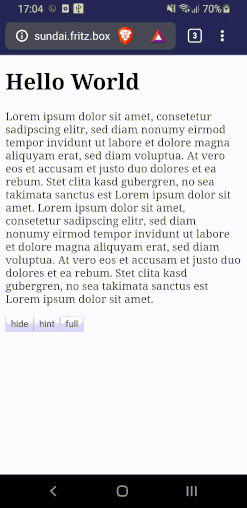
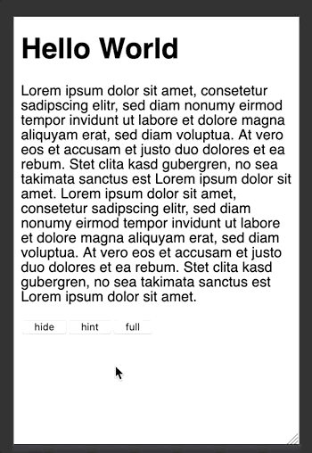

# preact-touchable-dock
[](https://badge.fury.io/js/preact-touchable-dock)

> A touch and drag and droppable dock for single page web applications.

Mobile|Simulated Mobile
:-------------------------:|:-------------------------:
  |  

## Installation

```bash
$ npm i --save preact-touchable-dock
# or
$ yarn add preact-touchable-dock
```

## Usage

```html
<!doctype html>
<html>
  <head>
    <meta charset="utf-8"/>
    <title>Touchable Dock Demo</title>
    <meta name="viewport" content="width=device-width, initial-scale=1" />
		<script src="https://unpkg.com/preact@10.4.6/dist/preact.min.js"></script>
		<script src="https://unpkg.com/htm@3.0.4/dist/htm.js"></script>
		<script src="./TouchableDock.min.js"></script>
		<script type="module">
      const { h, Component, render } = preact;
      const htm = window.htm;

      const html = htm.bind(h);

      class ControllableDock extends Component {
        state = {
          stage: "hide"
        }
        render() {
          const { stage } = this.state;
          return html`
            <h1>Hello World</h1>
            <p>
              Lorem ipsum dolor sit amet, consetetur sadipscing elitr, sed diam nonumy eirmod tempor invidunt ut labore et dolore magna aliquyam erat, sed diam voluptua. At vero eos et accusam et justo duo dolores et ea rebum. Stet clita kasd gubergren, no sea takimata sanctus est Lorem ipsum dolor sit amet. Lorem ipsum dolor sit amet, consetetur sadipscing elitr, sed diam nonumy eirmod tempor invidunt ut labore et dolore magna aliquyam erat, sed diam voluptua. At vero eos et accusam et justo duo dolores et ea rebum. Stet clita kasd gubergren, no sea takimata sanctus est Lorem ipsum dolor sit amet.
            </p>
            <button onClick=${() => this.setState({stage: "hide"})}>hide</button>
            <button onClick=${() => this.setState({stage: "hint"})}>hint</button>
            <button onClick=${() => this.setState({stage: "full"})}>full</button>
            <${TouchableDock}
              style=${{
                borderTop: "1px solid black",
                backgroundColor: "white"
              }}
              stage=${stage}>
              <h2>This is a dock text</h2> 
            <//>
          `;
        }
      }

      render(html`<${ControllableDock} />`, document.body);
  </script>
  </head>
  <body>
  </body>
</html>

```

### Notes

- `TouchableDock` inserts inline classes via [JSS](https://cssinjs.org). This
allows users to customize its style by adjusting classes like  `.touchableDock`
and `.touchableDockHandle`.

## Contributing

```bash
$ git clone git@github.com:TimDaub/preact-touchable-dock.git
$ cd preact-touchable-dock
$ npm i
$ npm run dev
```

## Changelog

### 0.1.0

- Deliver CSS classes as JS-generated inline classes using JSS

### 0.0.1

- Initial release
